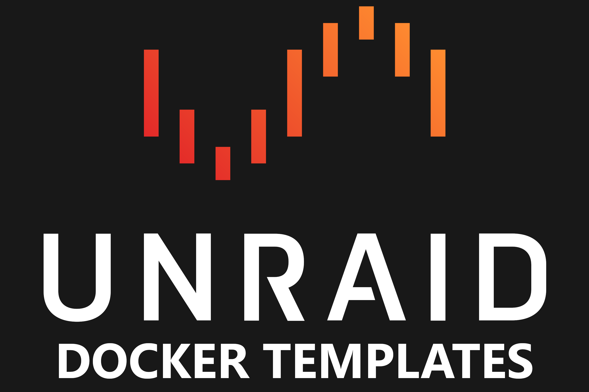
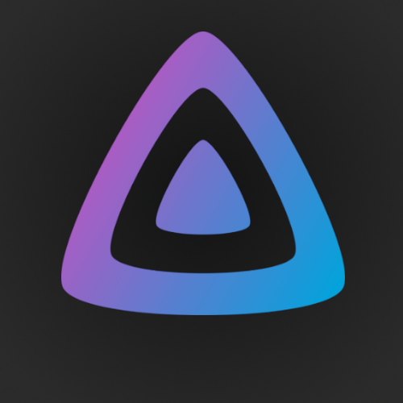

#  Available Templates

-  **[Dash.](https://getdashdot.com/)** A modern dashboard for monitoring the hardware usage of your machine. ``Dashboard``, ``Hardware``, ``Monitoring``
-  **[Homarr](https://homarr.dev)** An easy to use dashboard that integrates with many of your favorite tools. ``Dashboard``, ``Organization``, ``Productivity``
-  **[Jellyfin Discord music bot](https://github.com/manuel-rw/jellyfin-discord-music-bot)** Discord bot that plays music from Jellyfin ``Entertainment``
-  **[Slskd](https://github.com/slskd/slskd)** A web-based Soulseek client for browsing http://www.slsknet.org/ ``Downloader``, ``Sharing``
-  **[Wakapi](https://wakapi.dev/)** Open source tool to help you keep track of your development time on different projects and programming languages. ``Productivity``, ``Monitoring``

# 💵 Donate
Please donate to the authors of these applications if you found them to be useful. If you liked the Unraid template, you can also donate to me: https://ko-fi.com/manicraft1001